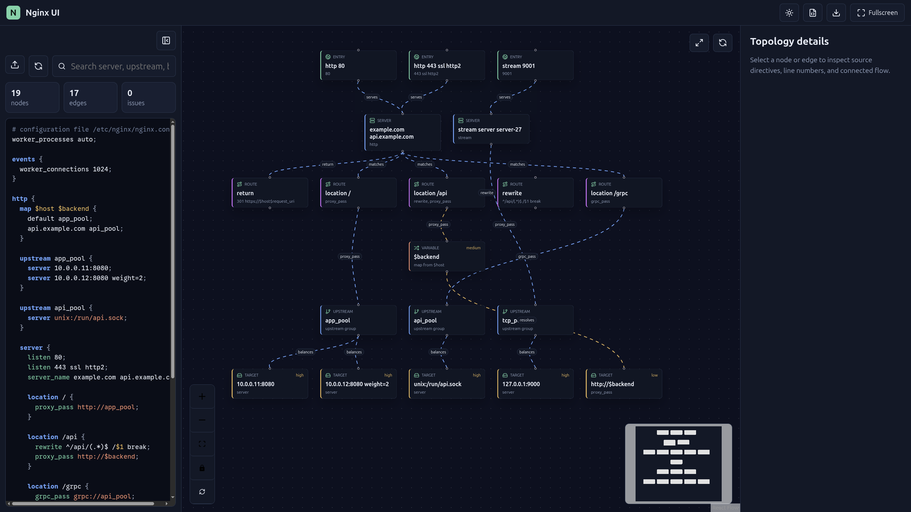
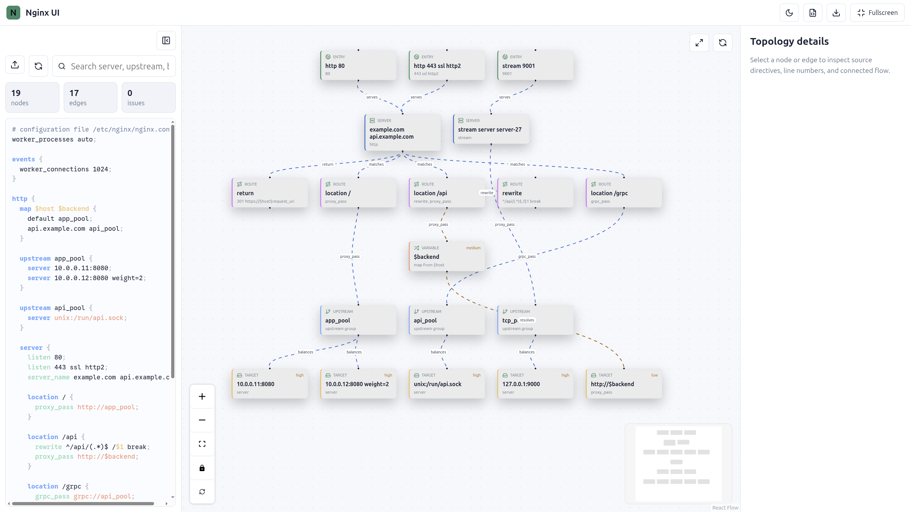

# Nginx UI Topology

> Upload `nginx -T` output, inspect the parsed configuration, and explore an animated routing topology in the browser.


Nginx UI Topology is a local-first web tool for visualizing nginx routing behavior. Paste or upload the output from `nginx -T`, then inspect servers, locations, upstreams, targets, variables, and request flow from an interactive topology canvas.

## Screenshots

### Dark Mode



### Light Mode



## Features

- Upload or edit `nginx -T` output directly in the browser.
- Syntax-highlighted nginx configuration editor with live topology updates.
- Interactive React Flow canvas with zoom, pan, minimap, fit view, and layout rotation.
- Visual nodes for entries, servers, routes, upstreams, dynamic variables, and backend targets.
- Animated data-flow edges with selection highlighting and unrelated-node dimming.
- Details panel for selected nodes and edges, including source directives and line information.
- Export topology as PNG or JSON.
- Local-first processing: configuration content is not uploaded to a server.

## Quick Start

```bash
npm install
npm run dev
```

Open the local development URL printed by Vite, usually:

```text
http://localhost:5173/
```

## Usage

1. Run `nginx -T` on a machine with nginx installed.
2. Upload the generated output or paste it into the left configuration editor.
3. Use search to find server names, upstreams, backends, or directives.
4. Click nodes or edges to inspect details.
5. Use **Rotate layout** to switch between left-to-right and top-to-bottom topology layouts.
6. Export the result as PNG or JSON when needed.

## Supported Nginx Concepts

The parser builds a lightweight AST from nginx-style blocks and directives, then derives a topology model from common routing primitives:

- `http`, `server`, `location`, `upstream`, `stream`, and `map`
- `listen`, `server_name`, and upstream `server`
- `proxy_pass`, `fastcgi_pass`, `grpc_pass`, `uwsgi_pass`, `scgi_pass`, and `memcached_pass`
- `rewrite`, `return`, and `try_files`
- Dynamic targets such as `proxy_pass http://$backend`

Complex runtime behavior such as Lua, njs, deeply dynamic variables, and full nginx location precedence simulation is represented visually where possible, but is not treated as an exact nginx runtime emulator.

## Scripts

```bash
npm run dev      # start the Vite dev server
npm run build    # type-check and build for production
npm test         # run Vitest tests
npm run preview  # preview the production build
```

## Tech Stack

- React + TypeScript
- Vite
- React Flow
- Lucide React icons
- html-to-image
- Vitest

## Privacy

All parsing and rendering happens in the browser. The app does not require a backend service and does not upload nginx configuration content.

## License

Apache-2.0. See [LICENSE](LICENSE).
